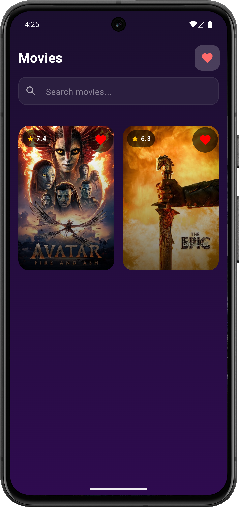
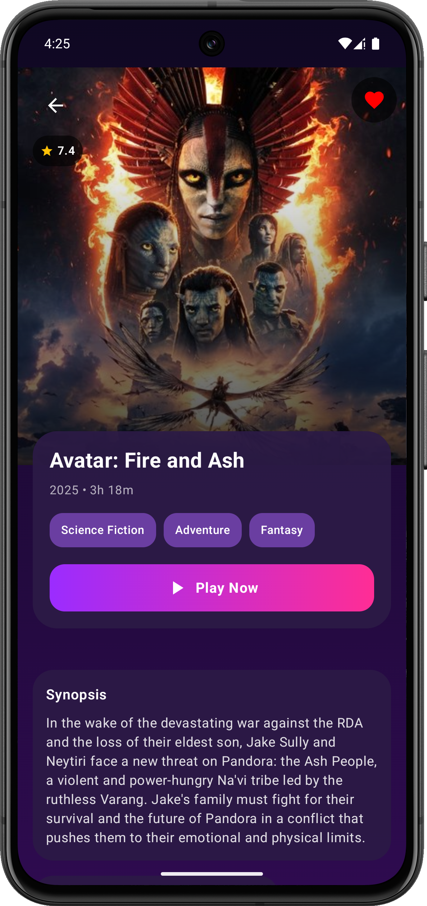

# Movie Showcase App (Kotlin Multiplatform + Jetpack Compose)

A polished Movie Showcase Android application backed by a Kotlin Multiplatform (KMP) shared library, built as part of the Android Developer Intern Assignment.
The project demonstrates clean architecture, shared business logic, reactive state management, and modern Jetpack Compose UI with animations and shared element transitions.

## Project Overview

This project consists of two separate projects:

* Kotlin Multiplatform Library (KMP)

  - Contains all business logic, networking, repositories, and state-holders (ViewModels).

  - Uses Ktor Client, Coroutines, Flows, and kotlinx.serialization.

  - Targets Android and iOS.

* Android App (Jetpack Compose)

  - Consumes the shared KMP library.

  - Implements all UI using Jetpack Compose and Material 3.

  - Includes shared element transitions, animations, and proper lifecycle handling.

## Features Implemented

### **Movies Grid / List Screen**

- Scrollable grid of movie posters

### **Movie Detail Screen**

- Shared element transition between grid poster → detail poster

### **Favourites Screen**

- Shows all favourited movies


## Architecture

The project follows MVVM with Unidirectional Data Flow (UDF)  

High-level Architecture

```
UI (Compose)  
   ↓  
ViewModel (StateFlow)  
   ↓  
Repository (KMP shared)  
   ↓  
Remote Data Source (Ktor)  
```

## Networking

API Used: The Movie Database (TMDB)

Client: Ktor Client (Multiplatform)

Serialization: kotlinx.serialization

Authentication: Bearer Token

### API key is not committed.
Add the following to gradle.properties:

TMDB_Token=your_tmdb_bearer_token_here

## State Management

- All screens observe StateFlow

- Favourite state is stored in a shared FavouritesStore

- Any favourite toggle updates all screens instantly

- Search, list, and detail screens remain consistent

### UI & Animations

- Jetpack Compose + Material 3

### Dependency Injection

Koin is used across:

KMP shared module

Android app

ViewModels are injected using koinViewModel()

### Libraries Used

- Kotlin Multiplatform

- Ktor Client

- kotlinx.coroutines

- kotlinx.serialization

- Jetpack Compose

- Material 3

- Navigation Compose

- Coil (image loading)

- Koin (DI)

### Demo

https://github.com/user-attachments/assets/a4b95c9d-e792-456b-9a2c-1e555f186986

<table>
  <tr>
    <td align="center">
      <br/>
      <b>Movies Grid</b>
    </td>
    <td align="center">
      <br/>
      <b>Favourites</b>
    </td>
    <td align="center">
      <br/>
      <b>Details</b>
    </td>
  </tr>
</table>
